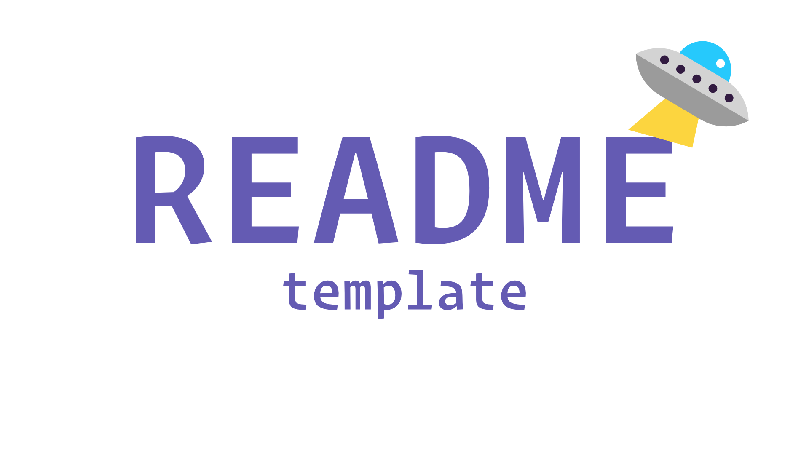

<div id="top" />

<!-- PROJECT LOGO -->
<br />
<div align="center">
  <a href="https://github.com/mylesberueda/windows-global-mic-control">
    
  </a>

<h3 align="center">Rust CLI Starter</h3>

  <p align="center">
    A starter template for a Rust CLI program
    <br />
    <a href="https://github.com/mylesberueda/windows-global-mic-control">
      <strong>Explore the docs »</strong>
    </a>
    <br />
    <br />
    <a href="https://github.com/mylesberueda/windows-global-mic-control">View Demo</a>
    ·
    <a href="https://github.com/mylesberueda/windows-global-mic-control/issues">Report Bug</a>
    ·
    <a href="https://github.com/mylesberueda/windows-global-mic-control/issues">Request Feature</a>
  </p>
</div>

<!-- TABLE OF CONTENTS -->
<details>
  <summary>Table of Contents</summary>
  <ol>
    <li>
      <a href="#about-the-project">About The Project</a>
      <ul>
        <li><a href="#built-with">Built With</a></li>
      </ul>
    </li>
    <li>
      <a href="#getting-started">Getting Started</a>
      <ul>
        <li><a href="#prerequisites">Prerequisites</a></li>
        <li><a href="#installation">Installation</a></li>
      </ul>
    </li>
    <li><a href="#usage">Usage</a></li>
    <li><a href="#roadmap">Roadmap</a></li>
    <li><a href="#contributing">Contributing</a></li>
    <li><a href="#license">License</a></li>
    <li><a href="#contact">Contact</a></li>
    <li><a href="#acknowledgments">Acknowledgments</a></li>
  </ol>
</details>

<!-- ABOUT THE PROJECT -->

## About The Project

[![Product Name Screen Shot][product-screenshot]](https://example.com)

Windows doesn't have a global mute button, I disagree that it's not necessary.

## Getting Started

I don't want to set up releases, so you need Rust to compile this project.

### Prerequisites

- [Rust](https://rust-lang.org)

### Installation

1. Clone the project

```sh
git clone git@github.com/mylesberueda/windows-global-mic-control
```

2. Build

```sh
cd windows-global-mic-control && cargo build --releaase
```

3. Copy the release into your path (better) or add the target to your path
   (unsafe, don't do that)

```sh
cp ./target/release/wgmc.exe /somewhere/in/your/path
```

4. Set a keybind that calls `wgmc.exe`. I use Powertoys (whose maintainers made
   the awesome decision to remove global mute from their own program), but you
   can probably use AHK or you can BadUSB yourself.

<p align="right">(<a href="#top">back to top</a>)</p>

## Roadmap

- [x] Add fn that toggles mic's mute state
- [x] Add notification to let the user know the mic state
  - [ ] Windows seems to throttle notifications from the same command, so
        sometimes the last state shows and the new state is pushed to a stack
        but doesn't actually notify the user.

See the [open issues](https://github.com/github_username/repo_name/issues) for a full list of proposed features (and known issues).

<p align="right">(<a href="#top">back to top</a>)</p>

<!-- LICENSE -->

## License

[](https://github.com/mylesberueda/windows-global-mic-control/blob/master/LICENSE)

Distributed under the MIT License. See `LICENSE` for more information.

<p align="right">(<a href="#top">back to top</a>)</p>

<!-- CONTACT -->

## Contact

### Myles Berueda

[](https://linkedin.com/in/myles-berueda)
[](https://mstdn.social/@mylesberueda)
[](https://github.com/mylesberueda)

<p align="right">(<a href="#top">back to top</a>)</p>

<!-- ACKNOWLEDGMENTS -->

<!-- ## Acknowledgments -->

<!-- - []() -->
<!-- - []() -->
<!-- - []() -->

<!-- <p align="right">(<a href="#top">back to top</a>)</p> -->

<!-- MARKDOWN LINKS & IMAGES -->

[product-screenshot]: .meta/screenshot.png
